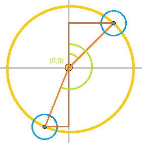

圓周上的小圓圈
=======


> 2018.03.07


## 頁籤


* [第一題： 一個圓周可以擠多少小圓？](#第一題一個圓周可以擠多少小圓)
* [第二題： 接續上題， 如何平均排列圓周上的小圓？](#第二題接續上題-如何平均排列圓周上的小圓)
* [範例程式碼](#範例程式碼)


## 第一題： 一個圓周可以擠多少小圓？


依上圖：

  * 雙橘線夾角： ![][Theta]
  * 橘紫線夾角： ![][Theta_b]
  * 黃色圓圈半徑： ![][r_1]
  * 藍色圓圈半徑： ![][r_2]

![][problemA]<br>
由計算機推算出 ![][Theta_b]， 在求出 ![][Theta]。

即可求得 ![][r_1] 半徑的圓周能擠下 ![][Theta_360_degree] 個 ![][r_2] 半徑的圓。


## 第二題： 接續上題， 如何平均排列圓周上的小圓？




取第一題的 ![][Theta] 、 ![][r_1] 即可達成要求。<br>
以 ![][Theta] 決定間距，
再用 ![][sin_Theta] 、 ![][cos_Theta] 算出 ![][X_Y] 座標即可。


## 範例程式碼


以爪哇腳本編寫：

```js
function smallCircleOnCircumference( numBigRadius, numSmallRadius, numOffsetDegree ) {
    var arrAns = {
        amount_precise: null,
        amount: null,
        pointList: null,
    };

    if ( numBigRadius < numSmallRadius ) return arrAns;

    var lenT;
    var amount, offsetRadian;
    var pointList = arrAns.pointList = [];
    var degreeToRadian = Math.PI / 180;
    var otherSide = Math.sqrt( Math.pow( numBigRadius, 2 ) - Math.pow( numSmallRadius, 2 ) );
    var degreeB = Math.atan2( otherSide, numSmallRadius );
    var degree = 180 * degreeToRadian - 2 * degreeB;

    amount = Number( Math.round( 360 * degreeToRadian / degree ) );
    arrAns.amount_precise = amount;
    amount = arrAns.amount = Math.floor( amount );

    lenT = amount;
    offsetRadian = numOffsetDegree * degreeToRadian;
    while ( lenT-- ) {
        pointList.push( [
            Number( ( numBigRadius * Math.cos( offsetRadian ) ).toFixed(2) ),
            Number( ( numBigRadius * Math.sin( offsetRadian ) ).toFixed(2) ),
        ] );
        offsetRadian += degree;
    }

    return arrAns;
}
```


[Theta]: https://render.githubusercontent.com/render/math?math=%5CTheta&mode=inline
[Theta_b]: https://render.githubusercontent.com/render/math?math=%5CTheta_b&mode=inline
[r_1]: https://render.githubusercontent.com/render/math?math=r_1&mode=inline
[r_2]: https://render.githubusercontent.com/render/math?math=r_2&mode=inline
[problemA]: https://render.githubusercontent.com/render/math?math=%5Cbegin%7Balign%7D%0A%5CTheta_b%3D90-%5CTheta%2F2%5C%5C%0A%5Ctan%5CTheta_b%3D((r_1)^2-(r_2)^2)%2Fr_2%0A%5Cend%7Balign%7D&mode=inline
[Theta_360_degree]: https://render.githubusercontent.com/render/math?math=%5CTheta%2F360%5Cdegree&mode=inline
[sin_Theta]: https://render.githubusercontent.com/render/math?math=%5Csin%5CTheta&mode=inline
[cos_Theta]: https://render.githubusercontent.com/render/math?math=%5Ccos%5CTheta&mode=inline
[X_Y]: https://render.githubusercontent.com/render/math?math=(X,Y)&mode=inline

